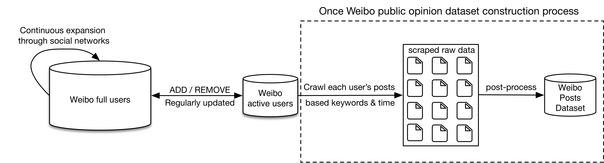

<h1 align="center">weibo-public-opinion-datasets</h1>

<p align="center">Continuously updated Sina Weibo Public Opinion Datasets (only for research)</p>

<p align="center">
  <a href="https://github.com/nghuyong/weibo-public-opinion-datasets/stargazers">
    
  </a>
  <a href="https://github.com/nghuyong/weibo-public-opinion-datasets/issues">
        
  </a>
  <a href="https://github.com/nghuyong/weibo-public-opinion-datasets/">
        
  </a>
  <a href="https://github.com/nghuyong/weibo-public-opinion-datasets/blob/master/LICENSE">
        
  </a>
</p>

<h2 align="center">Introduction</h2>

Sina Weibo is Chinese largest public social media platform. 
The latest and most popular social events will be disclosed and discussed on Weibo as soon as possible.
Therefore, it is of great significance to build a real-time and full-scale Weibo public opinion dataset.

At present, given specified keywords and a specified period, there are two kinds of methods for
constructing Weibo tweet datasets: (1) Applying advanced search API given by Weibo; (2) Traversing all Weibo users, collecting all their tweets in
the specified period, and then filtering tweets with specified keywords.

However, for the first kinds of method, due to
the limitation of the Weibo search API, the result of
one time search contains up to 1000 tweets, making it difficult to build large-scale datasets. As
for the second kinds of method, although we could
build large-scale datasets with almost no omissions,
traversing all billions of Weibo users requires very
long time and large bandwidth resources. 
In addition, a large number of Weibo users are inactive,
and it makes no sense to traverse their homepages,
because they may not post any tweets in the specified period.



To alleviate these limitations, we propose a novel
method to construct Weibo tweet datasets, which
can build large-scale datasets with high construction efficiency. Specifically, we first build and dynamically maintain a high-quilty Weibo active user
pool (just a small part of all users), and then we
only traverse these users and collect all their tweets
with specified keywords in the specified period.

<h2 align="center">Weibo Active User Pool</h2>
Based on init seed users and continuous expansion through social relationships, 
we first build a Weibo user pool including more than 250 million users.
The active Weibo user pool is constructed based on Weibo user pool and follow 4 rules:

|Item|Rule|Item|Rule|
|:---:|:---:|:---:|:---:|
|Follows number| \> 50 |Tweets number| \> 50 |
|Fans number| \> 50 |Recent post| \< 30 days |

Finally, we build a Weibo active user pool with **20 million** users, accounting for 8\% of the total number of weibo users.

<h2 align="center">Weibo Public Opinion Datasets</h2>

⚠️**Note that the following datasets all have been desensitized**

### COVID-19
**[UPDATE-2020-06-24]** Add the field of `user_id` to identify each user. 
To respect privacy, the released `user_id` is the **hashed result** of the origin Weibo `user_id`.

Paper: [Weibo-COV: A Large-Scale COVID-19 Social Media Dataset from Weibo](https://arxiv.org/abs/2005.09174)

- Time Period: 2019-12-01 00:00 - 2020-04-30 23:59 (GMT+8)
- Keyowds: [totle of 179 selected keywords](./keywords/COVID-19.txt)
- Amount: 
40,893,832 tweets filtered from 692,792,816 original tweets by keywords. 
In addition, we also release all original tweets with GEO tag without keywords filtering, covering 45,901,994 tweets.
```csv
_id,user_id,crawl_time,created_at,like_num,repost_num,comment_num,content,origin_weibo,geo_info
IBddo6Ee8,96e7c5482014ffbb,1587524917,2020-04-01 00:00,0,0,0,【#印度返乡人员被用水枪消杀# 长途步行回家20多人死在路上】3月30日，印度北方邦工作人员用水枪对返乡工人进行“消杀”。据媒体报道，这些人在德里等地打工。3月24日，印度宣布全国封锁21天。工人们没有了收入，因此选择回到家乡，但所有交通工具已停运，数百万人只能走路回家。#聚焦新冠肺炎疫情#@新京报我们视频 http://t.cn/A6ZSra22转发理由:转发微博,IBb2q8ghj,
IBddIwsjJ,40a4b94891260d41,1590476339,2020-04-01 00:00,0,0,0,【纽约州长科莫再次发出求助信号：请大家都来帮帮忙吧！】当地时间3月31日，纽约州州长安德鲁•科莫再次发出求助信号，请求全国的医护人员来支援纽约州抗击新冠肺炎。他表示其他州的疫情有可能也会和纽约州一样严重，现在帮助纽约就是帮自己。这是同舟共济的时刻啊！据悉，目前只有亚特兰大市的数十名医护人员准备前来援助纽约抗击新冠肺炎疫情。#纽约州州长感谢中国捐赠1000台呼吸机#（视频：一侨 编辑：世东） http://t.cn/A6ZoEAEF转发理由:转发微博,IBcwKmamg,
IBddsgrW8,bbb2f1be4131dde7,1587585761,2020-04-01 00:00,0,0,0,日本人气编剧、演员#宫藤官九郎#确诊新冠肺炎！ 转发理由:………？？？宫九？？[失望],IBcb6ejVk,
IBddu1G7S,3bf1604511aee5dd,1587531260,2020-04-01 00:00,1,0,0,#乔木美国疫情日记#  你有一个美国梦吗？你想了解真实的美国吗？你还在听什么房东和K驴瞎吹牛逼吗？骚年，李爷我给你推荐一下@乔木DC ，著名的北外乔木。想当年，为了追求自由呼吸香甜的空气，去国怀乡不远万里到了美国。现如今，为了尽可能给你一个真实的疫情下的美国，乔木开始了他的#乔木美国疫情日记# ，在他的日记里，一不开篇说今天天气怎么了，二不听医生朋友说，三不叫撞天屈（不公、黑幕、极左）。乔木直奔主题，以自己的所见所闻，描述美国人看病的艰辛和工作的不易。转发理由://@踏遍天山:乔老师危险了——国内写日记的“汪主席”只是被“极左”网上攻击，而美国前面有个写日记的蓝蓝已经“意外”死于车祸——“出门被车撞死”在美国是真实的[黑线],IB1cMdj3B,
IBddFiWg6,dd4a4eac5fa1acdf,1590144952,2020-04-01 00:00,8,1,4,许可馨，苏州人，中国药科大学2019届本科毕业生。公派留学生，目前就读于匹兹堡大学。 李文亮医生垂危之际出口成脏，骂留学生，骂中国人，恨国蛆一枚，怎么就争取到公费资助的呢？ 前有厦门大学田佳良，后有药科大学许可馨，我们的大学怎么就培养出这么多精致的双面人？ 建议药大追加开除，建议取消公费资助，建议追究提供公费资助的机构负责人责任，建议彻查此渣相关联系人背景，净化社会空气。 【补充评论】#留学生许可馨# 的两面人表现值得重视，不可一斥了之，轻轻放过。 此人家境优越，顺风顺水，还托国家的福成了公派留学生，可谓精英家庭成功培养出的精英学子。可是她的内在，却具有鲜明的反社会型人格。 据许可馨的初中同学爆料：许可馨在初中人品就极差无比，成绩很好但是心肠歹毒，随手携带一个小本本，上面都是骂人的话。有网友扒出许可馨的小号，其污浊与下贱更是让人目瞪口呆。 大家是否记得，电影《少年的你》里面有一个名叫魏莱的优等生，面容姣好、目光清澈、成绩出色、人畜无害，实际上却心思毒辣、霸凌同学甚至置人于死地。这种女孩的典型特征是：家境优渥、成绩出色、人人当她们是好学生，其实却是狠毒渣女，极致两面人。 具体到许可馨身上，就是突然呈现另一付嘴脸，对外跪舔，对内鄙夷，其他案例如：洁洁良、杨舒平等。 教育部门必须深刻反省，不能允许诸如此类的反社会人格者利用自己的伪装占尽社会便宜，然后再反噬社会。[组图共11张]转发理由:广大微友虽然有些戾气，言论有些过于犀利，可听着很舒服！ 关于许可馨发表的不当言论，居然也有人给洗白？花钱就可以让一些水军抛弃良心颠倒是非吗？花钱就可以下热搜吗？ 还是说她背后所牵扯的实力够大，罔顾广大微民的愤怒，强行洗白！是否需要一起查查许可馨背后的保护伞了！,IB3OCyTtK,
IBddw8jIx,01c31da0c3b9b553,1590145129,2020-04-01 00:00,0,0,0,【#你好，明天#】高考确定延期，备战的日子又“充值”一个月。从忧心“翻车”到立志“翻盘”，不少人五味杂陈。但请相信，时间不会辜负每一分努力，梦想不会怠慢每一个脚印。对考生而言，因为疫情见证了历史，更因为坚持参与着历史。健康和公平，一个都不能落下；现在和未来，每一个都要抓在手中。 转发理由:[加油],IBd4FplhX,
```
- Download:
If you want to acquire the corpus. Please fill the [application form](https://raw.githubusercontent.com/nghuyong/weibo-public-opinion-datasets/master/.github/Weibo_COV_Application_Form.pdf) and send to Yong Hu (huyong@bit.edu.cn) and Anfan Chen(caf16@ustc.edu.cn).

- Cite this dataset
```
@misc{hu2020weibocov,
    title={Weibo-COV: A Large-Scale COVID-19 Social Media Dataset from Weibo},
    author={Yong Hu and Heyan Huang and Anfan Chen and Xian-Ling Mao},
    year={2020},
    eprint={2005.09174},
    archivePrefix={arXiv},
    primaryClass={cs.SI}
}
```

<h2 align="center">Citation</h2>

If you use this work in a scientific publication, I would appreciate that you can also cite the following BibTex entry:

```
@misc{nghuyong2020@weibo-public-opinion-dataset,
  title={weibo-public-opinion-dataset},
  author={Yong Hu},
  howpublished={\url{https://github.com/nghuyong/weibo-public-opinion-dataset}},
  year={2020}
}
```